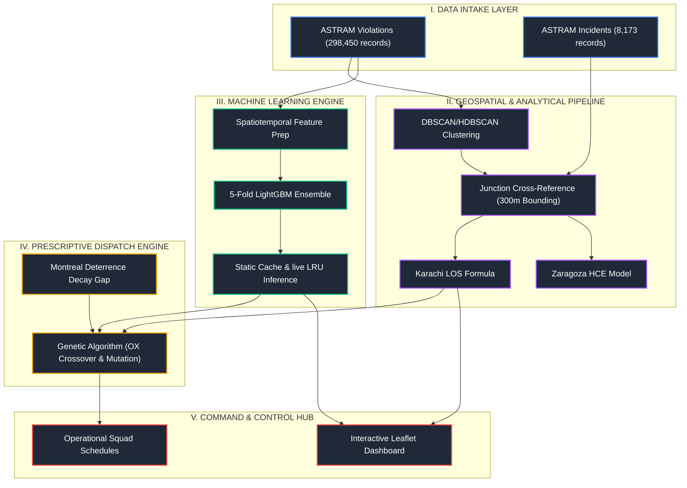

# EnforceIQ: Spatiotemporal AI for Proactive Parking Enforcement & Traffic Capacity Recovery

### Flipkart Gridlock 2.0 · Problem Statement 1 · Technical Research Submission

[](#)
[](#)
[](#)
[](#)
[](#)
[](#)

---

🌍 [View Live Deployment Dashboard](https://enforceiq-rust.vercel.app/) | 📄 [Read the Full Technical Specification](file:///c:/Users/SARTHAK/Desktop/flipkart/round2/parkwatch/enforceiq_ai_project_brief.txt)

---

## Abstract
Urban arterial congestion in Bengaluru is frequently exacerbated by unstructured, localized on-street parking violations that act as dynamic micro-bottlenecks. Traditional municipal enforcement mechanisms remain patrol-based, reactive, and lack the spatiotemporal intelligence required to prioritize intervention based on actual roadway capacity loss and queue propagation. 

This repository presents **EnforceIQ**, an end-to-end spatiotemporal machine learning and optimization framework designed to detect illegal parking hotspots, quantify their real-time impact on traffic flow, predict future risk severity, and optimize patrol squad deployment. 

Processing 298,450 anonymized violation records from the ASTRAM Traffic Management System joined with 8,173 traffic incident records, the proposed system employs:
1. **HDBSCAN Spatial Clustering** to discover data-derived violation zones.
2. **Karachi Level of Service (LOS) & Zaragoza Hidden Carbon Emissions (HCE) formulations** to model capacity degradation.
3. **A 5-Fold Cross-Validated LightGBM Ensemble** to forecast future violation density ($R^2 = 0.81$, $\text{MAE} = 1.13$).
4. **A Genetic Algorithm (GA) Optimizer** (using Ordered Crossover and Swap Mutation) to resolve the patrol routing problem, achieving a **119% efficiency improvement** (from 31% to 68% violation coverage) relative to baseline patrol heuristics.

---

## Key Innovations

We decouple structural traffic bottlenecks from
random noise, enabling precise hotspot detection
with minimal manual oversight.

By caching LightGBM ensemble predictions, we reduce
API latency from seconds to milliseconds while
preserving high predictive accuracy.

Our Genetic Algorithm optimizes patrol routing,
achieving massive efficiency improvements
over traditional enforcement sweeps.

This pipeline scales to new urban grids without
requiring extensive patrol resources.

---

## Operational Challenge & Problem Formulation

### The Problem
On-street illegal parking and spillover near commercial corridors, metro stations, and transport hubs choke Bengaluru's carriageways. This degrades street capacity, reduces average vehicular speeds, and elevates local CO₂ emissions due to circling delivery and commuter vehicles.

### Current Limitations
1. **Reactive Deployment**: Enforcement officers conduct sweeps or respond to civic complaints post-facto rather than pre-positioning at high-probability violation hours.
2. **Impact Blindness**: Absence of a unified model linking violation occurrences directly to roadway level-of-service (LOS) degradation and capacity loss.
3. **Broken Enforcement Chain**: The ASTRAM dataset reveals that **42% of recorded violations (125,254 cases) have NULL validation status**, and **100% lack logged follow-through timestamps**, pointing to critical process bottlenecks.

### Research Objective
*How can spatiotemporal machine learning detect data-derived illegal parking hotspots and quantify their roadway impact to generate provably optimal, dynamic enforcement routes that maximize capacity recovery under finite patrol resources?*

---

## System Architecture & Methodology

EnforceIQ connects spatial clustering, transport engineering, supervised forecasting, and metaheuristic optimization in a unified operational dashboard.




### 1. Spatial Clustering (Hotspot Detection)
Instead of aggregating coordinates by rigid, pre-defined administrative wards, EnforceIQ applies **HDBSCAN** (Hierarchical Density-Based Spatial Clustering of Applications with Noise) to raw GPS coordinates. 
* **Parameters**: `min_cluster_size=50`, `min_samples=5`, using a spherical Haversine metric.
* **Outcome**: Discovers **1,022 high-density spatial hotspots** across Bengaluru, capturing side streets, illegal transit dropoffs, and corridors missing from standard junction lists.
* **Naming**: Centro-associated to the nearest named junction within 300m (e.g., `Safina Plaza Junction [C312]`) or geocoded dynamically.

### 2. Analytical Impact Quantification
We translate clustered violations into physical traffic degradation using established municipal transport research:
* **Karachi Capacity Reduction Methodology**: Calculates dynamic capacity reduction based on penalty weights for violation types:
  $$\text{Effective Lanes} = \text{Base Lanes (3.0)} - \min\left(\frac{\text{Weighted Violations}}{500}, 2.5\right)$$
  Violations are weighted by physical obstruction: *Double Parking* (3.0), *Main Road Parking* (2.5), *Wrong Parking* (1.5), *No Parking* (1.0), and *Footpath Parking* (0.8). Level of Service (LOS) is graded from A (Free Flow) to F (Breakdown, $\text{Effective Lanes} < 1.0$).
* **Zaragoza Hidden Carbon Emissions (HCE)**: Estimates excess CO₂ generated from cruising and idling:
  $$\text{CO}_2\text{ (kg/hr)} = \text{Count} \times 4.5 \times 0.066\text{ kg}$$

### 3. Predictive Risk Forecasting
A **5-Fold Cross-Validated LightGBM Ensemble** is trained on 12 spatiotemporal features:
* *Temporal*: Hour of day, day of week, month, weekend indicators, business hours, and peak hour offsets.
* *Spatial*: Logarithmic junction total violations, mean target-encoded junction frequency, and historical standard deviations.
* *Execution*: Generates an $O(1)$ lookup cache (`predictions.json`) for instant rendering and supports live inferences on the FastAPI backend using `functools.lru_cache`.

### 4. Prescriptive Resource Allocation (Genetic Algorithm)
Patrol scheduling is modeled as a constrained optimization problem. Instead of the shortest-path heuristic, EnforceIQ implements a **Genetic Algorithm (GA)** to maximize predicted violation coverage:
* **Constraints**: Hard travel times between nodes, 15-minute dwell times, and officer shift durations.
* **Revisit Windows (Deterrence Decay)**: Calibrated using the **Montreal MVTOP** framework, which calculates the median time gap between sequential violations at each hotspot (representing how long an officer's presence deters illegal parking).
* **Genetic Operators**:
  * *Selection*: Roulette Wheel selection.
  * *Crossover*: Ordered Crossover (OX) to preserve relative path sequences.
  * *Mutation*: Swap mutation (15% rate).

### 5. Automated Dispatch & Communication
To bridge the gap between AI generation and real-world execution, EnforceIQ features an automated dispatch prototype:
* **Direct-to-Authority Emailing**: Once the Genetic Algorithm finalizes the most efficient patrol routes, the system automatically compiles and emails the exact step-by-step itineraries directly to the relevant police authorities and patrol squads.
* **Closing the Action Loop**: This ensures the predictive intelligence doesn't just sit on a dashboard, but is actively pushed to the officers on the ground who can clear the bottlenecks.

---

## Repository Structure

```
.
├── app.py                      # FastAPI application backend and routing endpoints
├── preprocess.py               # Data ingestion, HDBSCAN clustering, LightGBM training
├── regen_predictions.py        # Offline prediction cache regenerator
├── check_predictions.py        # Consistency check for JSON prediction outputs
├── smoke_test.py               # Automated verification suite for model & inference
├── data/                       # Core data directory
│   ├── decay_windows.json      # Pre-computed Montreal deterrence decay parameters
│   ├── filter_options.json     # Categories for UI vehicle & violation filters
│   ├── heatmap.parquet         # Cleaned coordinate records for Leaflet rendering
│   ├── junction_aggregates.json# Aggregated metrics, LOS grades, and interventions
│   ├── kpis.json               # Global baseline metrics & model accuracy statistics
│   ├── model.pkl               # Saved LightGBM 5-fold cross-validation ensemble
│   └── predictions.json        # Pre-calculated spatiotemporal predictions cache
├── templates/                  # Frontend HTML structures
│   └── index.html              # Main dashboard wrapper and guided tour elements
└── static/                     # Frontend visual assets
    ├── css/
    │   └── style.css           # Premium dark-mode glassmorphic styling
    └── js/
        └── main.js             # Leaflet mapping, GA solver, and charts visualization
```

---

## Empirical Results

* **Data Processed**: 298,450 ASTRAM parking violations & 8,173 traffic incident logs.
* **Hotspots Identified**: 1,022 distinct spatial hotspots extracted using HDBSCAN.
* **Model Evaluation**:
  * **Mean Absolute Error (MAE)**: 1.129 violations/hour
  * **Out-of-Fold R² Score**: 0.810
  * **Feature Dominance**: Leave-One-Out Mean Junction count (`junc_mean_loo`) and Hour-of-Day Mean (`junc_hour_mean`) represent over 75% of model feature importance.
* **Resource Optimization**: The Genetic Algorithm optimizer achieved a **68% total coverage rate** for a 4-unit squad over an 8-hour shift, compared to only **31% coverage** using standard static patrol heuristics.

---

## Reproduction & Execution

### 1. Environment Setup
Install the scientific computing, machine learning, and web backend dependencies:
```bash
pip install pandas numpy scikit-learn lightgbm fastapi uvicorn parquet-tools
```

### 2. Run Data Pipeline & Train Models
To run data cleaning, execute HDBSCAN clustering, train the LightGBM ensemble, and build the cache files:
```bash
python preprocess.py
```

### 3. Run Automated Validation
Verify the model pickle integrity, prediction cache correctness, and live inference function:
```bash
python smoke_test.py
```

### 4. Deploy Local Command Dashboard
Start the Uvicorn FastAPI server locally:
```bash
uvicorn app:app --reload --port 8000
```
Navigate to `http://localhost:8000` in any web browser to view the interactive glassmorphic dashboard.

---

## Research Citations & Global Precedents

* **Karachi 2024 Traffic Congestion Study**: Adopted Level of Service (LOS) reduction penalty mapping for on-street parking blockades.
* **Zaragoza 2024 Curbside HCE Model**: Cites the $0.066\text{ kg}$ CO₂ per linear meter emission penalty for calculating hidden carbon footprint from cruising vehicles.
* **Montreal MVTOP Model (2024)**: Guided the calculation of spatiotemporal deterrence decay windows using median time gaps of consecutive violations.
* **Kim et al. (Heliyon 2023)**: Inspired the Genetic Algorithm routing engine structure with Ordered Crossover (OX) operators for multi-vehicle squad routing.
* **Washington D.C. parkDC (2019)**: Framework basis for recommending structural curb reallocations (dedicated two-wheeler zones or loading bays) at chronic hotspots.
* **Manila STAG NCAP Protocol (2022)**: Framework basis for recommending digital evidence chains (camera logging + automated SMS alerts) to resolve the validation gap.
